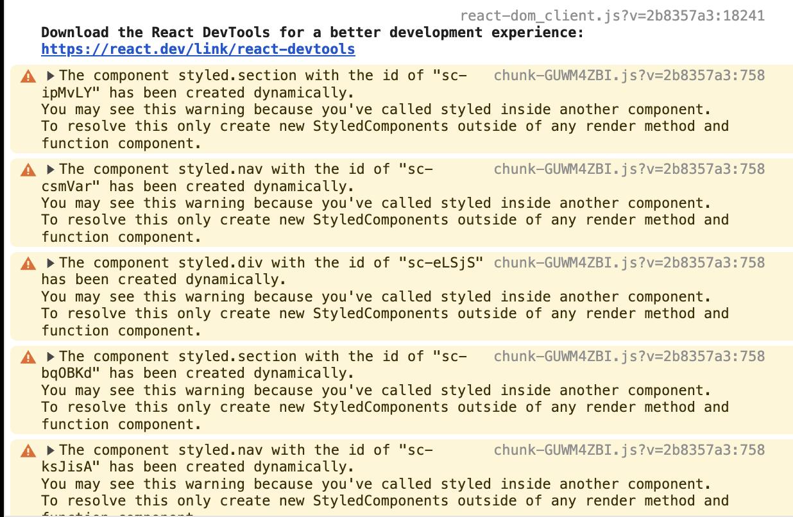
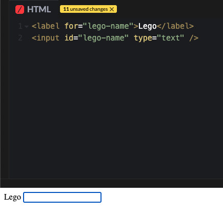
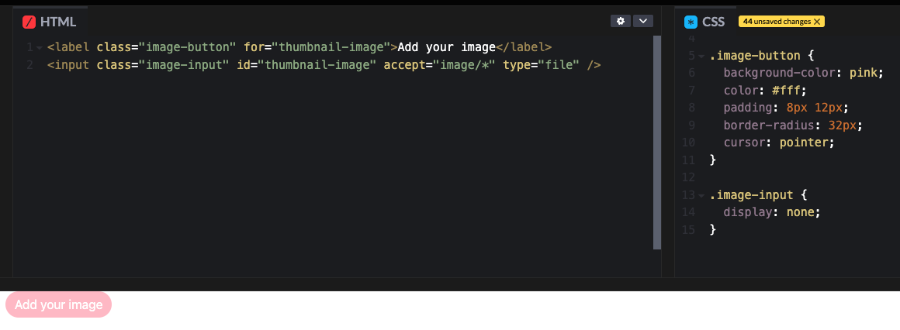

## **소제목(제목) 별 분류**
- ✏️: 별개 포스트로 다루고 싶은 내용
- 🚧: 약간 부족한 느낌이 들 때, 내용 보충이 필요한 단락(핵심을 일단 추렸다면 지우기)

## **🔭 학습 예정 내용**
- React-Router-DOM의 Outlet은 뭘까?
- 복수의 input 필드에 대한 useState는 어떻게 관리하는 것이 좋을까?
- Styled-components 관련
    - id가 랜덤으로 생성되는 원리
- 그 외 오늘 다 못 채운 내용 보충
- MIME Type
- label for, input id의 Specification
- flex, grid에 관한 핵심만 짚은 간단 메모
- Anti Pattern

## 💡 주로 배운 내용
### 간단하게 요약
- Twitter Clone Coding 챌린지 과제 해결이 최우선이었기에, Tweet Posting 관련 내용을 심층적으로 학습함.
- 그 외에 건진 내용은 label-for의 동작, Styled-Components에서 에러가 뜨는 문제 해결 정도.

### Styled-Components


#### 현상
Styled Components의 스타일 컴포넌트들이 동적으로 생성되었다고 하므로, 렌더링을 할 컴포넌트에 끼우지 말고 바깥으로 빼두라고 하고 있음. 
이게 Console 창에 경고만 뜨는 게 아니라, TextArea 컴포넌트의 경우 focus가 강제로 풀리는 현상까지 있었음.
다른 분들이 작성하신 코드에는 경고창도 뜨지 않고 Textarea 컴포넨트에서 버그도 없었으나, 내가 작성한 코드에서는 경고도 뜨고 버그도 걸려서 고칠 필요가 있다고 판단됨.

#### NG 코드
```jsx
export const PostTweetForm = () => {
    // 렌더링 컴포넌트 내부에 styled Components가 정의됨
    const Form = styled.form``
    const TextArea = styled.textarea``

    //...
}
```

#### 고치기
경고도 뜨지 않고 Textarea에서의 비정상적인 동작도 없어짐.

```jsx
// 렌더링 컴포넌트 내부에 styled Components가 정의됨
const Form = styled.form``
const TextArea = styled.textarea``

export const PostTweetForm = () => {
    //...
}
```

## 🍵 복습 / 우려먹기
### Twitter Clone Coding(3년 전 코드 해설)
#### Home.js
- props로 userObj를 가지고 있음. 현재 로그인하고 있는 유저에 관한 정보를 Props로 받고 있다.
- nweets 배열을 기준으로 Map 함수를 돌림.
- nweets, setNweets로 useState를 정의함.
- useEffect를 이용해 처음 렌더링될 때 onSnapshot 메소드를 실생함.
  - 이 메소드는 onSnapshot 메소드를 이용해서 실시간으로 Tweet을 받아옴.
- Nweet의 isOwner 값을 nweets 맵의 각 nweet 객체와 userObj Props를 통해 참조해서 판정을 내린다.

```jsx
import React,{ useEffect, useState } from "react";
import { collection, onSnapshot } from "firebase/firestore";
import { dbService } from "fbase";
import Nweet from "components/Nweet";
import NweetFactory from "components/NweetFactory";

const Home = ({ userObj }) => {
    const [nweets,setNweets] = useState([]);

    useEffect(()=>{
        onSnapshot(collection(dbService,"nweets"), (snapshot) => {
            const nweetArray = snapshot.docs.map(doc => ({
                id:doc.id, 
                ...doc.data(),
            }));
            setNweets(nweetArray);
        });
    },[]);

    return (
        <div className="container">
            <NweetFactory userObj={userObj} />
            <div style={{ marginTop: 30 }}>
                {nweets.map((nweet) => (
                    <Nweet 
                        key={nweet.id}
                        nweetObj={nweet} 
                        isOwner={nweet.creatorId === userObj.uid}
                    />
                ))}
            </div>
        </div>
    );
}
```
화면에 렌더링되는 컴포넌트 구성은 다음과 같다.
- div container를 통해 Home.js의 대략적인 레이아웃을 정의하고 있음.
- Tweet을 작성하는 컴포넌트 NweetFactory + Tweet 리스트를 불러오는 map 메소드로 Tweet 리스트를 표시하고 있음.
- React, Next.js에서는 map 함수를 통해 배열을 반환할 경우 key 값을 반드시 갖도록 추천함.

#### Nweet.js
역할 정의
- Tweet 컴포넌트로서 고유 데이터를 가지고 있고, 그걸 바탕으로 화면 상에 트윗을 표시함.
- 편집, 삭제를 할 수 있도록 기능을 제공함.
  - Firebase.ts에서 dbService, storageService 라이브러리 Instance를 가져온다
  - Firebase의 deleteDoc, updateDoc 메소드를 이용해 API 통신을 이용
- 편집 모드와 비편집 모드 기준으로 별도의 내용을 렌더링함.
  - isEditing, setIsEditing로 상태 관리를 함
  - 편집 모드일 경우 취소 버튼을 통해 false로 toggle하고, 일반 모드일 경우 편집 버튼을 눌러 true로 toggle함.
  - 작성자가 아니라면 편집 버튼을 누를 수 없다.

[1] Component Props 정의
```jsx
const Nweet = ({nweetObj, isOwner}) => {
//...
}
```
- 화면 상 렌더링시킬 nweetObj를 가지고 있음
- isOwner boolean props로 해당 트윗이 지금 로그인한 유저가 썼는지를 판단함


[2] onDeleteClick
- 클릭 시 삭제 여부를 물음
  - OK 시 deleteDoc 메소드를 통해 FireStore에서 document를 삭제함
  - 파일이 있을 경우 deleteObject 메소드를 이용해 파일을 삭제함
  - 실패 시 에러 메시지를 띄우는 것으로 예외처리

```jsx
 const onDeleteClick = async () => {
        const ok = window.confirm("정말 이 트윗을 삭제하시겠습니까?");
        if(ok) {
            try {
                //해당하는 트윗 파이어스토어에서 삭제
                await deleteDoc(doc(dbService, "nweets", `${nweetObj.id}`));
                //삭제하려는 트윗에 이미지 파일이 있는 경우 이미지 파일 스토리지에서 삭제
                if (nweetObj.attachmentUrl) {
                    const desertRef = ref(storageService, nweetObj.attachmentUrl);
                    await deleteObject(desertRef);
                }
            } catch (error) {
                window.alert("트윗을 삭제하는 데 실패했습니다!");
            }
        }
    };
```

### label-for에 관한 내용
label element의 for attributes에 input의 id를 입력하는 것은, 단순히 ‘이 Label은 해당 form control element을 가리킨다’는 의미만 가지고 있지 않음.
HTML 언어의 특징으로 인해 프로그램 상으로도 두 요소를 연관을 지어주며(programmatically associated), Label을 눌렀을 때 해당 input에 focus가 되도록 할 수 있다. 스크린 리더 등에서는 Input Element를 선택할 때에도 어떤 값을 입력해야 하는지 알려주기도 한다고 함.
SNS의 이미지/파일 업로드 기능을 구현할 때 label로도 구현 가능함.



```html
<label for="lego-name">Lego</label>
<input id="lego-name" type="text" />
```



### Next.js
#### _app.tsx
App Component를 커스터마이징할 때 쓰이는 파일.

#### _document.tsx
HTML 문서를 커스터마이징함. 여기서는 onClick 등 클라이언트 측 메소드는 사용할 수 없다.

## 🤔 피드백