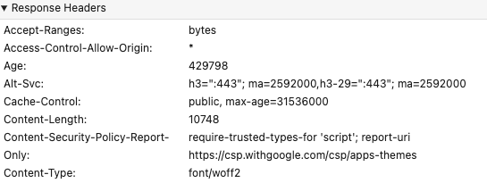
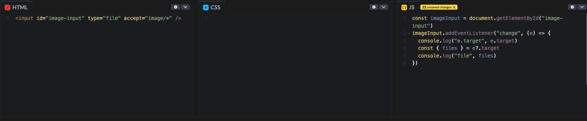
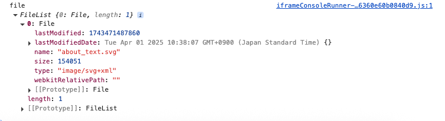
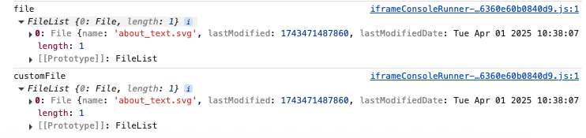

## **소제목(제목) 별 분류**
- ✏️: 별개 포스트로 다루고 싶은 내용
- 🚧: 약간 부족한 느낌이 들 때, 내용 보충이 필요한 단락(핵심을 일단 추렸다면 지우기)

## 💡 주로 배운 내용
#### 간단하게 요약
Twitter Clone Coding Contest에서 쓴 코드 중 마음에 걸렸던 부분, 그 전에 학습하기로 해놓고 기록을 깜빡한 부분 등을 추렸다.
주로 새로운 내용을 습득했다기보다는 알고 있다는 착각을 지우는 방향으로 공부함.

### Property 추가 JS 문법
```jsx
const person = {
  firstName: "John",
  lastName : "Doe"
}

Object.defineProperty(person,"job",{value:"programmer"})
```

Object.defineProperty 메소드를 통해 person 객체에 "job": "programmer" 속성을 추가할 수 있음.

```jsx
const tweetDoc = await addDoc(collection(db, DB_COLLECTION_PATH), tweetObj)

if (file) {
  const locationRef = ref(storage, `${DB_COLLECTION_PATH}/${user.uid}-${user.displayName}/${tweetDoc.id}`)
  const uploadResult = await uploadBytes(locationRef, file)
  const downloadURL = await getDownloadURL(uploadResult.ref)
  const updatePhotoPayload = { photo: downloadURL }
  await updateDoc(tweetDoc, updatePhotoPayload)
  setFile(null)
}
```

addDoc + updateDoc으로 이루어진 Tweet 작성 + 사진 업로드 기능을 하나로 합칠 수 없을까? 고민하다가,
잠시 tweetObj 객체에 그냥 downloadURL을 끼울 수 있는 방법으로서 Object.defineProperty가 있다는 것 정도는 알아냈다.
일단 실제 적용은 검증 후 로직을 고쳐볼 예정.

### MIME Type
```jsx
<CustomInput type="file" accept="image/*" />
```

Input Element의 image/*를 보고 떠올라서 기록함.
파일, Document 등 미디어 타입을 가리키며, 브라우저가 웹 서버로부터 받은 파일의 타입을 해석하기 위함이라고 한다.

대표적으로는
- text/javascript
- text/css
- image/jpeg
가 있고, 이외에도 여러 가지 MIME Type가 있기에 상황에 맞게 정의할 수 있음.



덤으로, HTTP Response Header에서 다음처럼 Content-Type에서 지정되어 확인할 수 있음.

### const { } = foo(Destructuring)
Destructuring: unpacking arrays, or properties from objects.
- 분할 대입(일본어)
- 구조 분해 할당(한국어)

배열이나 객체(Object)의 각 값을 분해(unpack)해서 할당시키기 위한 변수 선언.

```JS
{x, y} = foo;
// x = foo.x;
// y = foo.y;


const { files } = e?.target
const { files: customFile } = e?.target

const arr = [1, 2, 3];
const [a, b, c] = arr;
// a = 1, b = 2, c = 3
```

files 변수 선언 부분의 경우 아래와 같이 동작함.
- const files = e?.target.files의 값을 받아씀.(properties 이름 그대로)
- { files: customFile }인 경우, const customFile = e?.target.files의 값을 받아씀.

### Input type="file"에 관해
```jsx
<CustomInput type="file" accept="image/*" />
```


input type="file"인 경우 버튼(혹은 Input과 연결된 label)을 클릭해서 파일을 고를 수 있게 된다.

크게 다음과 같은 특징이 있는데
- onChange 이벤트(React의 React.ChangeEvent<HTMLInputElement>로 명시 가능) 발생 시의 e param에서는 files라는 속성값이 있다.
- 때문에 onChange 메소드나 change 이벤트 핸들러의 경우 e.target.files, 정확히는 e.target.files[0]을 통해 파일에 접근할 수 있다.
- 기본적으로는 파일을 하나만 올릴 수 있지만, multiple boolean atributes가 포함되면 파일을 여러 개 올릴 수 있게 된다.



const { files } = e.target은 const files = e.target.files를 뜻하며,
files를 console.log로 찍어보았을 때 이런 결과를 얻을 수 있다.



응용 편. const { files: customFile } = e.target로 정의할 경우 customFile로 e.target.files 값의 액세스가 가능함.


## 🍵 복습 / 우려먹기
### Vite를 통한(+React) 환경 변수 지정
.env 파일에는 VITE_로 시작하도록 환경변수를 설정하고,
불러올 때는 import.meta.env로 적을 것.

```env
VITE_API_KEY=foo
VITE_APP_ID=foofoo
```

```jsx
const firebaseConfig = {
  apiKey: import.meta.env.VITE_API_KEY,
  authDomain: import.meta.env.VITE_AUTH_DOMAIN,
  projectId: import.meta.env.VITE_PROJECT_ID,
  storageBucket: import.meta.env.VITE_STORAGE_BUCKET,
  messagingSenderId: import.meta.env.VITE_MESSAGING_SENDER_ID,
  appId: import.meta.env.VITE_APP_ID,
  measurementId: import.meta.env.VITE_MEASUREMENT_ID
}
```

### TypeScript에서 Props를 넘겨주기
Props란 컴포넌트(Component) 간 특정한 변수를 가지고 커뮤니케이션(communicate)하기 위한 값으로,
TypeScript에서는 일반적인 ReactJS와 달리 타입 지정 작업까지 필요하다.
그래도 크게 두 가지 동작으로 나눌 수 있음.

- type Props = {}를 통해 Props에 쓰일 타입을 지정함
- React의 방식대로 컴포넌트에 Props를 지정하고, 타입을 알려줌

```jsx
import styled from "styled-components"

const Wrapper = styled.div`
    cursor: pointer;
`

type Props = {
    width?: number
    onClick?: (e: React.MouseEvent<HTMLDivElement, MouseEvent>)=>void
}

export const EditIconButton = ({ width = 25, onClick }: Props) => {
  return (
    <Wrapper onClick={onClick}>
        <svg width={width} data-slot="icon" fill="currentColor" viewBox="0 0 20 20" xmlns="http://www.w3.org/2000/svg" aria-hidden="true">
            <path d="m2.695 14.762-1.262 3.155a.5.5 0 0 0 .65.65l3.155-1.262a4 4 0 0 0 1.343-.886L17.5 5.501a2.121 2.121 0 0 0-3-3L3.58 13.419a4 4 0 0 0-.885 1.343Z"></path>
        </svg>
    </Wrapper>
  )
}
```

type Props를 통해 타입을 명시하고,
EditIconButton의 param으로서 width, onClick 값을 {}(curly brace)로 감싼다.
그 후 타입을 Props로 알려주기만 하면 TypeScript 사양에 맞춰 컴포넌트 정의가 가능함.

```jsx
  const toggleEditMode = () => (setIsEditMode(prev => !prev))
  
  const DisplayNickname = () => (
    <Name>
      {user?.displayName ? user.displayName : DEFAULT_NICKNAME}
        <EditIconButton onClick={toggleEditMode} />
    </Name>
  )
```

## 🤔 피드백
인풋을 할 때, 너무 많은 내용을 한번에 욱여 넣으려고 하거나(어떤 내용을 써야할 지 대략적으로 정리가 되지 않았거나)
큰 짜임새를 놓치다 보니 '무엇을 위주로 정리할까?'가 확실하게 녹아 있지 않는 듯함.
무작정 자료 인풋을 하면서 자료 내용에만 신경쓰기 & 포스트 체급을 불리기에 신경쓰기보다는
내가 쓸 기술 포스트의 구조나 얼개를 정해두고 적으면 좀 더 퀄리티 높은 TIL을 쓸 수 있을 것 같다.

'오늘 키워드는 비동기 처리, 내가 프로젝트에서 구현한 로직에 관한 처리를 올리고 싶다. 그렇다면 이 내용을 어떤 구성으로 짜면 좋을까?'
대략적으로 이런 글의 구조 트리를 그려 보고 대략적인 짜임새를 생각하는 훈련을 거치면
앞으로 TIL 뿐만 아니라 기술 포스트를 쓸 때도 훨씬 나아질지 모름.