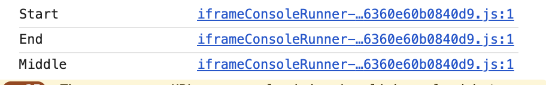

# **소제목(제목) 별 분류**
- ✏️: 별개 포스트로 다루고 싶은 내용
- 🚧: 약간 부족한 느낌이 들 때, 내용 보충이 필요한 단락(핵심을 일단 추렸다면 지우기)

# 💡 주로 배운 내용
## 간단하게 요약
JavaScript에서의 비동기 처리 코드는 어떻게 돌아가는가?에 관한 내용을 공부하면서 많이 걸리는 내용을 건졌다.   
그 과정에서 Event Loop, JavaScript Engine, Callback Queue 등 JavaScript의 동작 원리를 공부했으나,  
내용이 방대해져 전반적인 구조를 잡으면서 공부하기보다는 각 파트에 대한 해설 위주로 학습했다.

## 비동기 함수의 작동 원리(✏️)
20250419 TIL에서도 기록했듯,  
JavaScript는 싱글 스레드 구조의 프로그래밍 언어라  
특정 상황(API Fetch, 파일 읽기 등 시간이 많이 걸릴 수 있는 Task)에서는 비동기 프로그래밍을 통한 기능 구현이 필수적이다.  

JavaScript는 싱글 스레드면서도 non-blocking 특징, 즉 프로세스를 방해하지 않고 백그라운드에서 태스크를 처리할 수 있는 비동기 프로그래밍 기능도 가지고 있다.  
한편, JavaScript의 특징으로 인해 비동기 함수는 일반 동기 함수보다는 타이밍이 한 단계 늦게 실행된다.

```
console.log("Start")
setTimeout(()=>{
	console.log("Middle")
	}, 0)
console.log("End")
```



이렇게 발생하는 이유는 아래의 JavaScript Runtime Environment에서  
코드가 어떻게 움직이는지에 대한 원리와 연관이 깊음.

## JavaScript Runtime Environment(✏️)


### Call Stack
- Stack이라는 이름처럼, 스택 자료구조의 형태(LIFO, Last In First Out)로 동작을 한다. 
- 일반적인 동기 함수가 호출되면 이 Call Stack에 차곡차곡 쌓이며 가장 최근에 들어온 함수부터 pop됨.

### Event Loop
- Call Stack이 비었나 체크를 함. 일반적인 동기 함수가 전부 실행됐다면 그 후 Event Queue에서 비동기 함수를 가져와 Call Stack에 얹음.
- setTimeout 등 비동기 함수가 일반적인 동기 함수에 비해 항상 늦게 실행되는 이유로, Call Stack에 상주하고 있던 동기 함수가 완전히 실행된 후 Queue에서 가져옴 
    - setTimeout 등의 비동기 함수는 Callback Queue에 편입됨
- 반대로 이런 특성 덕분에 비동기 함수는 non-blocking, 즉 JS의 프로세스와 웹 상에서의 동작, 상호작용을 방해하지 않음.
- 이런 이유로 Event Loop는 Call Stack과 Callback Queue 사이의 매니저(Manager)에도 비유되고는 함.

### 비동기 함수의 우선도
비동기 함수는 이렇듯 Call Stack에 상주하던 동기 함수가 실행되고 나서야 실행되지만, 비동기 함수 사이에서도 Microtask, Macrotask로 우선도가 나뉜다.  
예를 들어 Promise와 setTimeout는 같은 비동기면서도 코드 실행 순서는 Promise → setTimeout 순서로 빠지게 됨.

 

[1] Microtask  
fetch, Promise 계열의 메소드.  
  
[2] Macrotask  
setTimeout, setInterval 계열의 메소드.  
 
# 🍵 복습 / 우려먹기
# 🤔 피드백
중요하지만 한편으로는 조금 방대했던 내용을 단편적으로만 모은 감이 있다.  
내일 중에는 이 내용을 모아다가 조금 연결된 구조의 글로 쓰고 싶음.
