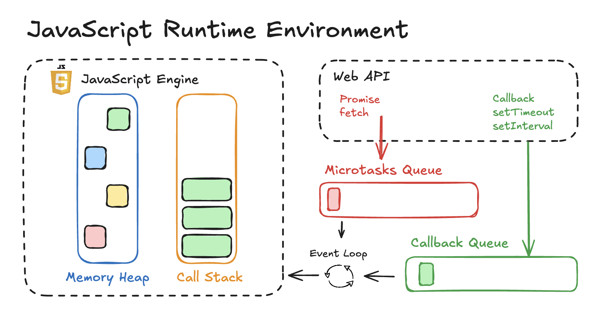
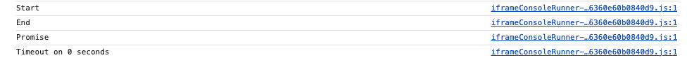

# **소제목(제목) 별 분류**
- ✏️: 별개 포스트로 다루고 싶은 내용
- 🚧: 약간 부족한 느낌이 들 때, 내용 보충이 필요한 단락(핵심을 일단 추렸다면 지우기)

# 💡 주로 배운 내용
## 간단하게 요약
2025/04/20 TIL의 내용과 크게 다르지는 않음.  
하지만 전날 TIL에 비해 JavaScript Runtime Environment에 관한 내용의 완성도가 낮다고 생각해,  
'비동기 함수가 어떻게 돌아가는가?'라는 주제보다는  
'JavaScript 코드는 어떻게 해서 움직이는가?'를 글 속에 잘 녹일 수 있도록 함.  
20250420 TIL에 비해서는 아래와 같은 내용을 추가함.

- JavaScript Runtime Environment란 **무엇**인가?
- JavaScript Engine에 대한 설명
- Web API에 관한 설명
- MicroTask Queue(=Job/Promise Queue), MacroTask Queue(=Task Queue)에 관한 좀 더 상세한 설명

글 주제 자체가 JavaScript Runtime Environment에 초점을 두고 있으므로, 20250420 TIL과 어느 정도 겹치는 부분이 있다.

## JavaScript Runtime Environment(✏️)
동기/비동기 함수의 동작 원리 등을 포함해서, JavaScript의 근간을 이루고 있는 개념이므로  
따로 분리해서 정리할 필요가 있음.



JavaScript Code가 브라우저 상에서 돌아가기(Execution) 위한 일종의 **컨테이너(Container)**와 같은 환경을 뜻함.
아래에서도 정의하듯, Runtime은 프로그래밍 언어가 실행되기 위한 일종의 환경(Environment)이라고 할 수 있음.

>***What is runtime?***  
>Runtime is a piece of code that implements portions of a programming language's execution model.  
>In doing this, it allows the program to interact with the computing resources it needs to work.  
>
>**Runtime system**  
>In computer programming, a runtime system or runtime environment is a sub-system that exists in the computer where a program is created, as well as in the computers where the program is intended to be run. 

내용이 샜지만, 아무튼 JavaScript Runtime은 JavaScript가 브라우저 상에서 돌아가기 위한 일종의 환경으로서  
로직을 실행하기 위해(변수를 저장하고 함수를 실행하는) Stack, Queue, Heap 등의 자료 구조(Data Structure)를 사용함.  
JavaScript Runtime Environment는 크게 5가지 파트로 나눌 수 있다.  

- JavaScript Engine
  - Memory Heap
  - Call Stack
- Web API / libuv
- Event Loop
- MicroTask Queue(=Job Queue, Promise Queue) 
- Callback Queue(=Task Queue)

### JavaScript Engine
JavaScript Code를 파싱(Parse) → 실행(Execute)시켜주며,  
JIT(**J**ust-**I**n-**T**ime) 컴파일 기법에 의해 기계어로 변환되자마자 실행할 수 있도록 함.  
예전에는 순수 인터프리터였으나, 모던 JavaScript에서 JIT 컴파일 기법이 도입되었다고 한다.  
사람이 작성한 코드(Human-readable code)를 컴퓨터가 이해할 수 있는 기계어(Machine Code)로 번역시켜 준다.
**JavaScript의 심장부**로 비유되며, 브라우저 별로 내장하고 있는 JavaScript Engine 역시 제각기 다르다.

- Chrome - JavaScript V8
- FireFox - SpiderMonkey
- Apple Safari - JavaScriptCore

JavaScript Engine은 **클라이언트**, 즉 웹 브라우저(Web browsers)에서 JavaScript 코드를 돌리기 위해 개발되고 실행되는 한편,
Node.js와 같은 **서버 사이드 환경(Server-Side Environment)** 코드 환경에서도 쓰임.

#### Memory Heap
- 앱(JavaScript Application)이 필요한 오브젝트(Object)를 저장함.
- 주로 Array, Object 등의 복잡한 자료형 데이터를 저장함.

#### Call Stack(✏️)
- Stack이라는 이름처럼, **스택 자료구조**의 형태(LIFO, Last In First Out)로 동작을 하며, 한번에 함수 하나씩만 실행할 수 있다.
- 일반적인 동기 함수가 호출되면 이 Call Stack에 차곡차곡 쌓이며 가장 최근에 들어온 함수부터 pop됨.
- console.log 등 호출하자마자 바로 메시지를 출력하는 메소드의 경우 Call Stack에 추가되었다가 바로 pop됨.

JavaScript Engine 이외의 파츠인 **Web API, MicroTask Queue, Callback Queue**는 브라우저(Browser)에 의해 제공된다.

### Web API
JavaScript의 Capability를 확장시켜,  
비동기 함수가 백그라운드(Background)에서 Task가 돌아갈 수 있도록(execution) 하거나,  
DOM과 상호작용하여 웹 구조를 조작하거나,  
외부 리소스와의 상호작용(Interacting with external resources) 등을 돕는 역할을 한다.  
  
도식에 나와있는 것처럼,  
JavaScript Engine의 특징(feature)이라기보다는 브라우저(Browser)에 의해 제공되는 API라고 할 수 있음.
아래와 같은 예시가 Web API의 예시라고 할 수 있다.  

- DOM API
- Timers(setTimeout, setInterval)
- fetch API
- Event Listner
- Geolocation
- LocalStorage
- document, window Instance

Web API는 클라이언트, 즉 웹 브라우저에서 가지고 있는 API이며,  
따라서 Node.js 등 서버 사이드 JavaScript에서는 이 Web API가 없어 DOM Access 등의 동작을 수행할 수 없다.  
Node.js에서는 **libuv**라는 별도의 Node API를 제공하며, http, https, fs, requires 등의 메소드를 이용해 서버 쪽 코드를 작성하게 됨.  

### Event Loop
- Call Stack이 비었나 체크를 함. 일반적인 동기 함수가 전부 실행됐다면 그 후 Event Queue에서 비동기 함수를 가져와 Call Stack에 얹음.
- setTimeout 등 비동기 함수가 일반적인 동기 함수에 비해 항상 늦게 실행되는 이유로,  
Call Stack에 상주하고 있던 동기 함수가 완전히 실행된 후 Queue에서 Call Stack에 비동기 함수를 가져온다.
  - Promise 등의 Microtask 비동기 함수는 Microtask Queue에
  - setTimeout 등의 Macrotask 비동기 함수는 Callback Queue에 
- 반대로 이런 특성 덕분에 비동기 함수는 **non-blocking** 특징을 가진다.  
즉, JS의 프로세스와 웹 상에서의 동작, 상호작용을 방해하지 않음.
- 이런 이유로 Event Loop는 Call Stack과 Callback Queue 사이의 **매니저(Manager)**에도 비유되고는 함.

### Microtask Queue
fetch, Promise 계열의 메소드. Job Queue, Promise Queue라고도 한다.  
Call Stack에서 호출되는 일반적인 동기 함수에 비하면 우선도는 낮지만  
비동기 함수 중에서는 우선도가 높아 Call Stack이 비고 나서 이쪽이 먼저 실행된다.

### Macrotask Queue
setTimeout, setInterval 등의 메소드. Callback Queue라고 많이 부르며, Task Queue라고도 한다.  
UI Events, I/O Events, Timer, Callback Function 등이 포함되며,  
Promise 등의 MicroTask 비동기 함수에 비해 우선도가 낮아 실행 시기는 가장 마지막에 실행된다고 보면 됨.  
queueMicrotask(callback)처럼, queueMicrotask 메소드를 이용하면 Macrotask를 Microtask로 올릴 수 있다고 함.

# 🍵 복습 / 우려먹기
## JavaScript 코드가 실행되는 과정(✏️)
### 일반적인 샘플

```ts
console.log("Start")
setTimeout(() => {
  console.log("Timeout on 0 seconds")
}, 0)

Promise.resolve().then(() => {
  console.log("Promise")
})

console.log("End")
```



1. console.log("start")가 Call Stack에 불리며 Start를 표시, 동시에 pop되어 Call Stack에서 빠짐.
2. Call Stack은 비어 있는 상태지만, Event Loop에 의해 코드를 다 돌지 못 한 상태로, setTimeout 메소드를 MacroTask Queue에 삽입함.
3. Call Stack은 비어 있는 상태지만, Event Loop에 의해 코드를 다 돌지 못 한 상태로, Promise 메소드를 MicroTask Queue에 삽입함.
4. console.log("end")가 Call Stack에 불리며 End를 표시, 동시에 pop되어 Call Stack에서 빠짐.
5. 동기 함수(Synchronous Function)를 모두 돈 상태로, 비동기 Queue에 있는 메소드를 비교한다. 이 때 MicroTask에 있는 Promise가 우선순위가 높아 Promise 코드를 Call Stack에 올리고, 그 뒤 pop되어 빠진다.
6. 마지막으로 MacroTask에 있는 setTimeout 메소드를 Call Stack에 올린 후 pop시키며 실행시킨다.

### 복수의 setTimeout

```ts
// MA1 (Macro Async 1)
setTimeout(() => {
  console.log("Timeout on 2 seconds");
}, 2000);

// MA2 (Macro Async 2)
setTimeout(() => {
  console.log("Timeout on 1 seconds");
}, 1000);
```

첫 번째 setTimeout 메소드(통칭 MA1)가 두 번째 setTimeout 메소드(통칭 MA2)에 비해 정의는 먼저 되었지만, 
ms delay의 값 차이로 인해 MA2 → MA1 순서로 Queue에 삽입된다.


# 🤔 피드백
- Heap과 Stack의 차이점, 특히 Memory Heap에서의 메모리 할당의 원리에 대한 내용을 추가하고 싶다.
- Call Stack에서 동기 함수가 순서대로 할당되는 과정을 추가하고 싶음. 물론 TIL 단위로는 너무 무거워서 내용 분리가 필요할 듯함.

# 📚 참조
[JavaScript Runtime Explained](https://dev.to/ppiippaa/javascript-runtime-explained-all-you-need-to-know-about-client-side-js-code-execution-5g8e)