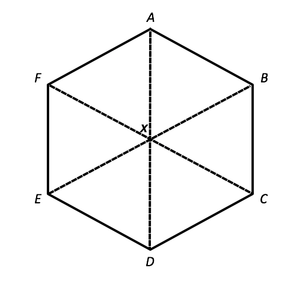
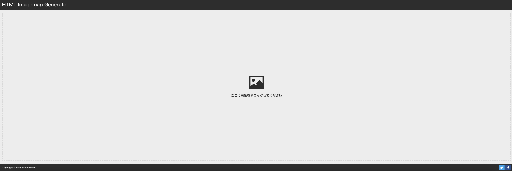
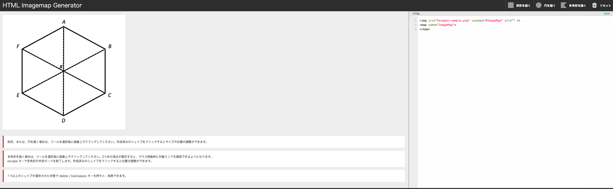

# **소제목(제목) 별 분류**
- ✏️: 별개 포스트로 다루고 싶은 내용
- 🚧: 약간 부족한 느낌이 들 때, 내용 보충이 필요한 단락(핵심을 일단 추렸다면 지우기)

# 💡 주로 배운 내용
## 간단하게 요약
- Zoom Clone 강의를 수강하면서 navigator.mediaDevices API를 이용한 비디오/오디오 액세스를 배웠다.  
그 외 핵심 기술 스택이 되는 WebRTC에 대한 이해도를 높이고 싶어 기본적인 내용을 찾아서 보충했다.
- 실무적으로는 img 태그에 map을 이용해서 링크 매핑을 할 수 있다는 점을 배워서 기록했다. 

## WebRTC(✏️🚧)
### 무엇 하는 친구인가?
**Web** **R**eal-**T**ime **C**ommunication의 약자로
웹 브라우저 상에서 비디오/오디오 등의 P2P(Peer to Peer Connection) 데이터 스트림을 가능하게 해 주는 Web API의 콜렉션이라고 볼 수 있다.

### How?
1. P2P(Peer to Peer) Connection  
2. Native Client(Android), 모던 브라우저 등 대부분의 플랫폼에서 기능을 지원함.  
웹 표준(Web Standard) 기준으로 빌드되어 브라우저 호환성 역시 걱정할 필요가 없다.  
3. 오픈 소스로, Apple, Google, Microsoft, Mozilla 등 대부분의 기업에서도 서포트를 하고 있다. 공식 문서 역시 Google WebRTC Team에 의해 유지보수가 이루어짐.

### 어떻게 쓰는가? 왜 쓰는가? 원리는 어떻게 되는가?
=> ICE(Internet Connectivity Establishment), TURN, STUN 등의 단어를 공식 문서를 통해 확인했지만 쉽게 이해가 되지 않아 보충 학습이 필요하다.

## Media Streams API를 이용한 비디오/오디오 액세스
브라우저에서 사용할 수 있는 **Web API**의 일종이다.  
이 MediaStreams API에서 파생된 MediaDevices 객체를 통해 화면 공유/사용자 디바이스의 비디오, 오디오 접근 등을 구현할 수 있다.  
그 중에서 사용자의 디바이스 정보를 얻기 위해서라면 `navigator.mediaDevices.getUserMedia()`라는 비동기 메소드가 필요하며,  
navigator.mediaDevices.getUserMedia 메소드는 Promise 문법으로도 구현 가능하다.

1. myStream의 값을 가변값 변수형 let으로 정의한다.  
2. 비동기 메소드 navigator.mediaDevices.getUserMedia를 통해 가져온다.  
3. video element를 JavaScript에서 DOM을 접근한다.(querySelector, getElementById 등)  
4. srcObject에 myStream을 할당시켜 User의 카메라/오디오 요소를 embed함.  

```js
section#my-stream
  video#my-face(autoplay, playsinline, width="400", height="400")
  button(id="mute", class="zoom-button") Mute
  button(id="camera", class="zoom-button") Camera Off
  select(id="camera-select")
```

Pug Template Engine을 통해서 작성한 myStream section.  
Video(Camera Video), Button(Mute, Camera Off), Select(Camera Select) 요소를 포함하고 있다.


```js
const myFace = document.getElementById("my-face")
let myStream = null

const getMedia = async () => {
	const constraints = {
            audio: true,
            video: true
        }
  
  try {
        myStream = await navigator.mediaDevices.getUserMedia(constraints)
        myFace.srcObject = myStream
    } catch (err) {
        console.error(err)
    }
}

getMedia()
```

이 때 getUserMedia 메소드를 호출하기 위해서는 특정 param을 갖다줄 필요가 있는데(constraints 객체)  
이 constraints는 getUserMedia 메소드에서 audio, video를 어떻게 처리할지에 관한 내용이다.  
  
constraints 값은 보통 기본값으로서 `{ audio: true, video: true }` 형태의 객체로 getUserMedia에 전달하는데,  
특정 디바이스가 필요한 경우에 deviceId값을 전달하거나 facingMode의 값을 수정하는 등 커스터마이징 역시 가능하다.

[MediaDevices](https://developer.mozilla.org/en-US/docs/Web/API/MediaDevices/getUserMedia)

## video element
비디오를 embed할 수 있는 HTML Element.  
video에 직접 src attribute를 지정해서 비디오를 재생할 수 있고,   
`<source>` 요소를 이용해서 비디오를 지정할 수 있다. 

```HTML
<video src="sample.mp4" controls>
  Your browser does not support the video tag.
</video>
```

```HTML
<video controls width="250">
  <source src="/shared-assets/videos/flower.webm" type="video/webm" />
  <source src="/shared-assets/videos/flower.mp4" type="video/mp4" />

  Download the
  <a href="/shared-assets/videos/flower.webm">WEBM</a>
  or
  <a href="/shared-assets/videos/flower.mp4">MP4</a>
  video.
</video>
```

그 외에도 controls, muted, autoplay, playsinline 등의 Boolean Attributes를 가지고 있다.

[MDN 공식문서](https://developer.mozilla.org/en-US/docs/Web/HTML/Reference/Elements/video)

### source element
`<picture>`, `<audio>`, `<video>` 등의 미디어 컨텐츠와 같이 쓰임.  
Void Element라 Closing tag가 따로 필요하지 않고 자체적으로 내용(content)을 가질 수 없다.  
  
위의 Video 요소의 예시에서는 source 요소가 여러 개 사용되었지만 기본적으로 브라우저 상에 표시되는 영상은 단 하나 뿐이다.  
브라우저가 webm 확장자 영상을 재생할 수 있는가?를 확인한 후 지원하지 않으면 mp4로 넘어가는 방식.  
  
Video tag나 소스 코드에서 정의한 Video MIME type을 브라우저에서 지정하지 않은 경우  
Video 태그 내의 에러 메시지(Your browser does not ....)를 표시함.  

[Source - MDN 공식문서](https://developer.mozilla.org/en-US/docs/Web/HTML/Reference/Elements/source#usage_notes)
[Void Element](https://developer.mozilla.org/en-US/docs/Glossary/Void_element)

## img + map(ImageMap)


이런 형태의 이미지를 받은 후, 각 피스를 클릭하면 특정 페이지로 이동하는 기능을 추가해달라는 의뢰가 들어왔다.  
이 기능은 img 태그와 map 태그를 이용해 Imagemap을 만들면 가능하다.
  
[Map Element](https://developer.mozilla.org/en-US/docs/Web/HTML/Reference/Elements/map)
  
Imagemap을 만들기 위해서는 map element를 정의해 mapname을 정한 뒤,  
img 태그에 usemap attribute와 연결시켜주면 된다.

```HTML

<map name="hexmap">
    <area shape="poly" coords="354,57,352,264,453,323,633,217,633,217" href="#reactjs" alt="reactjs" />
    <area shape="poly" coords="454,326,636,220,634,544,453,438,453,438" href="#vuejs" alt="vuejs" />
    <area shape="poly" coords="352,503,453,445,631,548,352,709,352,709" href="#angular" alt="angular" />
    <area shape="poly" coords="352,712,352,505,247,442,68,547,68,547" href="#flutter" alt="flutter" />
    <area shape="poly" coords="250,442,249,325,67,219,66,544,66,544" href="#vanillajs" alt="vanillajs" />
    <area shape="poly" coords="351,265,350,55,68,217,248,320,249,320" href="#jquery" alt="jquery" />
</map>
```
예시 코드.  
  
이 map 요소의 area는 ChatGPT를 통해서 짜달라고 해줘도 알아서 짜주긴 하지만,  
이미지를 올려서 영역을 표시하면 shape의 형태와 coords를 따주는 [일본의 웹 사이트](https://labs.d-s-b.jp/ImagemapGenerator/)가 있어 이쪽을 이용해도 상관없다.





### 반응형 Imagemap 구현하기
한편으로, 저렇게 Imagemap을 만들고 나면 저걸로 끝이 아니다.  
모바일 디바이스로 바꿔서 볼 경우 이미지맵 클릭 시 크기가 PC 기준이기 때문이라 이미지 크기와 이미지맵 사이즈가 안 맞을 수 있음.  
  
따라서 이렇게 이미지맵을 만들었다면 반응형(Responsive)으로 동작할 수 있도록 별도의 조치가 필요한데,  
그 중에 하나가 cdnjs.com의 jQuery 라이브러리 소스 코드를 이용해서 처리하는 방법이다. 

```HTML
<script src="https://cdnjs.cloudflare.com/ajax/libs/jQuery-rwdImageMaps/1.6/jquery.rwdImageMaps.min.js"></script> 
<script>
jQuery(document).ready(function(){ 
  jQuery('img[usemap]').rwdImageMaps(); 
});
</script>
```

[CDNJS 라이브러리 링크](https://cdnjs.com/libraries/jQuery-rwdImageMaps)

# 🍵 복습 / 우려먹기
# 🤔 피드백
동기부여가 잘 되지 않으면 일단 운동을 하고 오자.  
최근 동기부여가 떨어지는 바람에 약 일주일 정도 학습 자체를 놓아버렸는데,  
휴식 부족인가? 싶어서 조금 쉬엄쉬엄 했다.  
  
그렇게 꽤 쉬었다고 생각했는데도 집중력이 돌아오지 않아 고민하던 중,  
그 동안 운동이 밀렸다는 사실을 깨닫고 전날 헬스를 달렸다.  
  
간만에 운동을 하고 오니 그제서야 원래 페이스와 텐션이 돌아왔고,  
주 2-3회 정기적으로 하는 운동의 중요성을 새삼 다시 알 수 있었다.
# 📚 참조