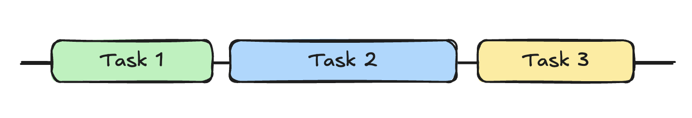
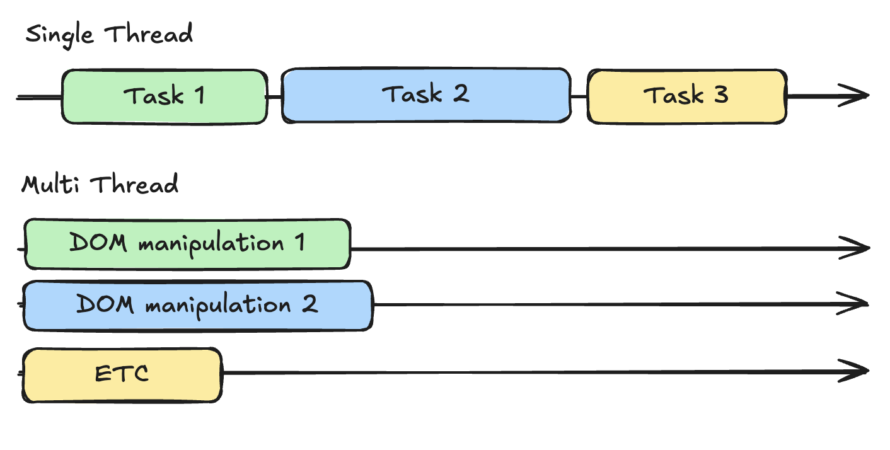

# 주제
JavaScript에서 비동기 처리 프로그래밍을 쓰는 이유는 무엇인지?

# 답
## 결론부터
JavaScript에서 비동기 프로그래밍을 사용하는 이유는, 시간이 오래 걸리는 작업(API 요청, 파일 읽기 등)이 **웹 상호작용이나 브라우저 동작을 방해하지 않도록** 하기 위함입니다.  
  
JavaScript는 **싱글 스레드(Single Thread)** 언어이기 때문에,   
시간이 오래 걸리는 작업을 동기적으로 처리할 경우 전체 실행이 멈추고 사용자 경험(UX)에 악영향을 줄 수 있습니다.
  
예를 들어 alert()처럼 코드 실행이 멈추면, 다른 UI 상호작용도 전부 정지됩니다.  
반면, 비동기 프로그래밍을 사용하면  
전체 코드 흐름(Flow)이 멈추지 않고 메인 스레드는 계속 사용자 인터랙션을 받아들일 수 있어 더 나은 사용자 경험을 제공할 수 있습니다.

## 해설
시간이 오래 걸리는(오래 걸릴 수도 있는) 코드를 실행할 때 **다른 코드의 처리를 지연시키지 않도록** 하기 위함.  
기본적으로 JavaScript에서 코드를 작성할 경우 위에서 아래 순서로 코드가 실행된다.

```js
// time1 → time2 → time3
console.log("time1")
console.log("time2")
console.log("time3")
```

MDN 공식 문서의 예시에서도 

```js
const name = "Miriam";
const greeting = `Hello, my name is ${name}!`;
console.log(greeting);
```

name이라는 String 변수 지정 → name을 사용하는 greeting이라는 string 변수 지정 → greeting 호출로  
"Hello, my name is Miriam!"이라는 출력값이 나오도록 하는, 전형적인 동기(Synchronous) 프로그래밍의 예시를 설명하고 있다.

하지만 이렇게 코드를 작성했을 때, 코드 도중에 이런 코드가 끼면 이야기가 달라진다.
- 시간이 오래 걸리는 작업(파일 읽기, 외부 API Request 등)
- 일정 시간 동안 기다렸다가 처리가 필요한 작업

```js
console.log("time1")
console.log("time2")
//약 6초 간 sleep하는 method
sleepForNMiliSeconds(6000)
console.log("time3")
```
이런 경우라면 time1 → time2가 실행된 다음 6초 기다렸다가 console.log time3이 출력되는 것으로 끝나는 게 아닌가? 싶지만,  
그걸로 끝나지 않고 코드 실행 뿐만 아니라 웹 브라우저 상에서의 동작이나 상호작용 등도 전부 차단됨.

MDN 공식 문서에서도 '무거운 코드를 Synchronous programming으로 작성했을 때 어떤 일이 일어나는가?'를 알려주고 있는데,


이렇게 도중에 시간이 많이 걸리는 코드가 꼈을 때,  
결과가 나오기 전까지는 화면 상에서 다른 작업을 할 수 없게 된다.

이렇게 alert() 메소드를 통해 에러창을 띄웠을 때를 떠올려보시면 알겠지만,  
이 alert 메소드의 처리가 끝나기 전까지는 버튼 클릭이나 화면 조작 등 아무것도 할 수가 없는 상태가 된다.  
  
이는 JavaScript가 기본적으로 **싱글 스레드(Single Thread)** 프로그래밍 언어로서 아래와 같은 처리 구조를 가지기 때문이다.



비동기 처리를 선언하지 않으면 이렇게  
Task1 코드의 처리에 리소스를 할당 → Task2 처리  → Task 3  → ... 순서로 한번에 하나씩의 작업만 수행할 수 있음.

이와 반대되는 개념이 스레드를 여러 개 나눠서 일을 병렬적으로 처리할 수 있는 멀티 스레드(Multi Thread) 구조로,  
JavaScript도 이렇게 멀티 스레드로 하면 되지 않냐 싶지만  
브라우저에서 동작하는 프로그래밍 언어 특성 상 기본적으로 정적인 웹 사이트(Static Web Sites)를 인터랙티브하게 만드는 것이 주 목표고,  
동작 환경도 단일 브라우저(Single Browser)가 대상이었으며 멀티 스레드에 대응하는 Use Case도 없어 지금까지 이대로 이어져 왔다.  



DOM 조작이 멀티 스레드로 이루어질 경우 작업에 지장이 생길 수도 있기 때문.

따라서, JavaScript는 이렇게 싱글 스레드 프로그래밍인 점을 인지하면    
시간이 많이 걸리는(걸릴 것 같은) 코드는 **비동기(Asynchronous)**적으로 실행할 수 있도록 하는 것이 중요하다.  
이 경우 전체적인 코드의 흐름을 멈추지(halt, freeze) 않고 사용자 경험(UX)을 제공할 수 있게 됨. 
