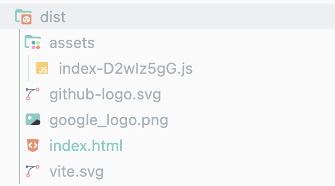

# Vite
## 간단 요약
React/Vue/Angular 등의 모던 프레임워크(Modern Framework) 내지 라이브러리 프로젝트의 빌드(Build)를 돕는 **빌드 툴(Build Tool)**.  
Vue.js의 개발자기도 한 **Evan You**가 만들었다고 한다.  
**Native ES Module**을 채용해서 Vite라는 이름답게 매우 빠른 개발/번들링(Bundling) 속도를 자랑하는 것이 특징.
  
한편, Create React App를 통한 프로젝트 구축과 Vite를 통한 프로젝트 구축을 비교하는 컬럼이 몇 개 있긴 했으나,  
Create React App이 없어진(depracated) 지금 적용할 수 있는 이야기는 아니다.

## 정의 및 역할
### Build Tool
Build Tool로서의 기본적인 기능을 제공함.  
현재 React App을 만들기 위해서는 풀스택 프레임워크(Full-stack framework)가 아니면 Vite와 같은 Build-Tool을 통해서만 할 수 있다.
  
- Bundling 역할 수행.  
  브라우저는 JavaScript 프레임워크/라이브러리 코드(특히 jsx, tsx, import 모듈 등) 그 자체로만은 내용을 알아들을 수 없기에,  
  브라우저가 이해할 수 있도록 import URL의 path를 node_modules/xxx/ 형태로 변환시켜주고 
  TypeScript 파일을 트랜스파일링 하는 등 Bundler의 역할을 수행함.
- Build 시 Rollup을 통한 번들링 기능 수행.
  

  
- Local Development Server 제공(localhost)
- build 커맨드를 통해 Deploy 기능 제공

## 특징 및 강점
### 속도
가장 독보적인 장점, 특징이 아닐까 함.  
어떤 컬럼에서는 이 스피드라는 특징으로 인해 프론트엔드 계에 혁명을 불렀다고 할 정도였음.

- Native ES Module을 채용해서 Cold Server Start 문제를 해결하고,  
  거의 즉각적인 수준의 HMR(Hot Module Replacement) 유저 경험을 제공하는 등 개발 스피드를 크게 끌어올렸다고 함.
- Bundle base dev Server와 다르게 Dynamic import 기능을 통해 보고 있는 화면(current screen)만 Import하는 알고리즘을 채택하고 있음.
- Bundle Size가 Webpack에 비해 작고 그만큼 속도도 매우 빠르며, 서버에 부담을 덜어준다.


[이 컬럼](https://kinsta.com/blog/vite-vs-webpack/#5-build-time-and-bundle-size)에서 특히 빌드 타임, bundle size 등 Vite가 webpack에서 얼만큼 나은지를 자세히 측정하고 있음.

### Zero Configuration
그밖에 프로젝트 초기에 만들어지는 vite.config.ts(js) 코드 볼륨도 매우 작다.

```ts
import { defineConfig } from 'vite'
import react from '@vitejs/plugin-react-swc'

// https://vite.dev/config/
export default defineConfig({
  plugins: [react()],
})
```

### Pre bundling & bundling
공식 문서를 읽다가 이 부분의 내용 정리가 잘 되지 않아 따로 정리했다.
  
- Pre-bundling
  - 성능, CommonJS & UMD와의 Compability를 위해 esbuild로 pre-bundling을 거침. esbuild는 Go 기반이라 특히 성능이 좋다고 함.
- Production Build:
  - esbuild로 bundling을 하지 않고 Rollup을 통해 Bundling을 수행한다.

## 활용(vs Webpack?)
React, Vue 등의 모던 프레임워크를 적극적으로 밀어주고 있다는 말처럼(Pushing the Modern Web)  
최신 JS 프레임워크를 통해 앱을 개발할 때, 더 나은 개발 경험과 스피드가 필요할 때 적합하다고 함.  
  
하지만 좀 더 유연성(Flexibility)과 커스터마이징이 필요한 대규모 & 복잡한 프로젝트에서는  
Webpack을 고르는 것도 적합할 수 있다는 의견도 있는만큼,   
'Vite가 Webpack을 완전히 대체할 수 있을까?'는 전망은 조금 더 지켜봐야 알 것 같다. [관련 컬럼](https://dev.to/debajit13/vite-vs-webpack-a-comparative-analysis-851)

이 컬럼은 스피드보다는 실제 사용 면에서의 비교를 하고 있어서 인용함.